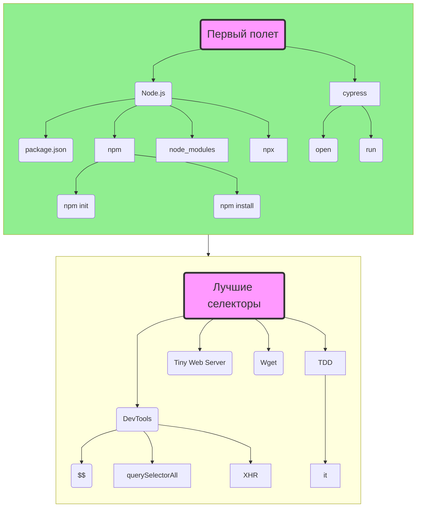

# Туториал: знакомство с живым Markdown

Подойдет тем, кто хочет писать свои интерактивные туториалы.

# 👍 Что сделаем
* Научимся ...

<mark>Задача: загрузить все в систему!</mark>



| id | username | password | balance            |
|:--:|:--------:|----------|--------------------|
|  1 | bob      | qwerty   | -123724.9999999    |
| 2  | marry    | qwerty   | 0                  |
| 3  | chester  | 123456   | 10123638.999999799 |

```markdown poll
Полезный материал?
* 🤩 Очень полезный материал
* 😃 В целом полезный
* 😐 Возможно что-то пригодится
* 😒 Нет ничего полезного
* 😬 Абсолютно бесполезно
```

# 🙋‍ Перед началом
* Желательно почитать по [Markdown](https://lifehacker.ru/chto-takoe-markdown/)

~"Кейс:" привет

Если ты просто хочешь просто посмотреть на возможности системы — пропускай задания.

```json robot check_user
{
  "endpoint": "https://ibank-robot.epic1h.com/check-user",
  "submit": "Проверить",
  "fields": [
    {
      "name": "me_gitlab_id",
      "placeholder": "User ID"
    }
  ]
}
```

```json message hello_from_anton
{
  "from": {
    "name": "Антон",
    "avatar": "https://s.epic1h.com/api/public/dl/nfCyhZhd?inline=true"
  },
  "src": "https://drive.google.com/uc?export=view&id=1l1kBR3XI1xDaSX02jLY8FfzxLibosE3P"
}
```

# +Как это работает?

Мы взяли стандартный Markdown синтаксис, добавили в него немного от Google Docs и Notion.

# +Возможности

## Создание оглавлений

```markdown
# +Уровень 1
## +Уровень 2
### +Уровень 3
```

Добавляя к заголовку `+` вы добавляете заголовок 

Just copy your markdown and create a online channel for your friends!

Berlin, the <md-placeholder value="capital"></md-placeholder> city of Germany.

It is renowned for its exceptional range of <md-placeholder value="landmarks"></md-placeholder>, vibrant cultural scene
and way of <md-placeholder value="life"></md-placeholder> that's somehow all go yet relaxed.

```html placeholders
<body>
    <!-- form -->
    <<!--?|form|?-->>
        <!-- primary -->
        <input class="?|primary|?">
    </form>
</body>
```

```js placeholders
describe('Sign up', () => {

  const rnd = /*?|Math.random|?*/();

  it.only('should do register user', () => {

    // open https://demo.realworld.io/
    cy.visit('https://demo.realworld.io/');

    // click Sign Up link in app header
    cy.get('?|.navbar a[href$="/register"]|?').click();

  });
});
```

***

# +What can you do?

> Sure, you can use common markdown markup.

What to do today:

* play guitar
* go to party
* meet with friends

> We support emoji 🙀 lists.

Do you like?

* ❓ books
* 💀 music

## Tasks

* [x] books
* [ ] music

<details>
    <summary>Do you really want to see it?</summary>

This content is hidden!
</details>
