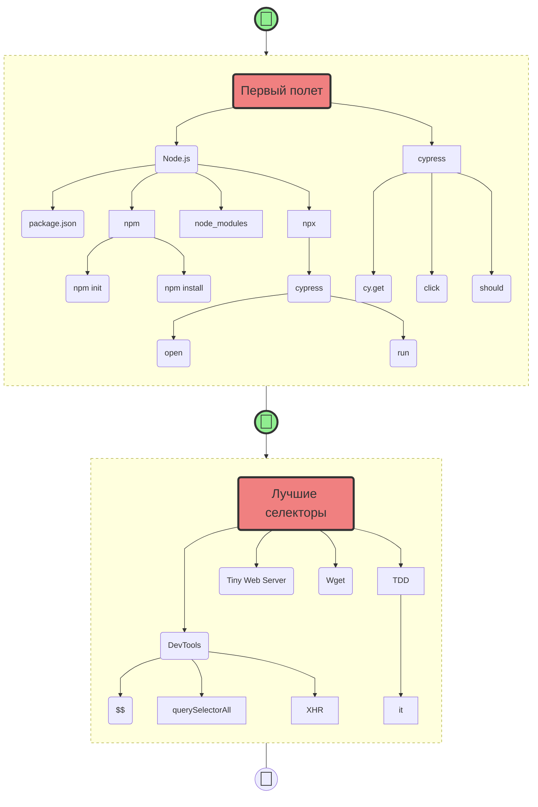

<section id="slide">
<h1 class="title">Туториалы<br>по ИТ навыкам</h1>

# hasd

Подойдет тем, кто хочет писать свои интерактивные туториалы.
</section>

<style>
h1.title {
  font-size: 5em;
  background: #121FCF;
  background: linear-gradient(to right, #121FCF 0%, #CF1512 100%);
  -webkit-background-clip: text;
  -webkit-text-fill-color: transparent;
}
#slide {
  padding: 20px 40px;
  background-color: #F1F3FC;
  border-radius: 10px;
}
</style>

# 👍 Что сделаем

* Научимся ...

<section id="slide">
# Мой подход

Я сторонник **проблемно-ориентированного** ~~программирования~~ обучения:

1. Выполняя **практические действия** и сталкиваясь с **проблемами** — у тебя возникают вопросы.
2. Получая ответы, ты ловишь **ага-эффекты!** Чем больше таких эффектов — тем большему ты научишься!

На сложные вопросы и **концепты** — я даю свои **расширенные** комментарии.
</section>

<mark>Задача: загрузить все в систему!</mark>

```text circle hello_from_anton25
{
  "time": 1.7,
  "video": "https://raw.githubusercontent.com/breslavsky/hello-cypress/main/assets/hello_from_anton.mp4"
}

Привет, [Anton](https://t.me/breslavsky_anton) на связи 🤙

Я — Тимлид и **разработчик** с более чем **15-летним** опытом. 

Мне 36, живу и работаю в Берлине, и у меня есть огромное желание **делиться** знаниями.

Перед тобой 👇 серия практических туториалов по авто-тестам на **Cypress**

Чистый **концентрат** — все как на работе, сразу в бой.
```

<details>
  <summary> Syllabus – учебный план <svg xmlns="http://www.w3.org/2000/svg" xmlns:xlink="http://www.w3.org/1999/xlink" width="18" height="18" fill="black" viewBox="0 0 24 24"><path d="M15.826 15.069a1.018 1.018 0 1 1-.001 2.036a1.018 1.018 0 0 1 0-2.036zM21.327 1.11a1.018 1.018 0 1 1 .001 2.036a1.018 1.018 0 0 1 0-2.036zM3.322 3.107h16.116a2.13 2.13 0 0 0 1.89 1.151a2.132 2.132 0 0 0 2.129-2.13A2.131 2.131 0 0 0 21.327 0c-.89 0-1.654.55-1.97 1.329H3.321C1.764 1.329.543 2.51.543 4.019v17.156C.543 22.706 1.816 24 3.322 24h17.155c1.51 0 2.738-1.267 2.738-2.825V10.998c0-1.532-1.228-2.78-2.738-2.78H10.3c-1.553 0-2.866 1.274-2.866 2.78v3.198c0 1.484 1.286 2.691 2.866 2.691h3.554a2.132 2.132 0 0 0 1.972 1.329c1.174 0 2.129-.956 2.129-2.13s-.955-2.129-2.13-2.129a2.13 2.13 0 0 0-1.889 1.152H10.3c-.523 0-1.088-.349-1.088-.913v-3.198c0-.524.519-1 1.088-1h10.177c.538 0 .96.439.96 1v10.177c0 .567-.44 1.047-.96 1.047H3.322c-.533 0-1-.49-1-1.047V4.02c0-.52.43-.912 1-.912"></path></svg></summary>



</details>

| id | username | password | balance | |:--:|:--------:|----------|--------------------| | 1 | bob | qwerty |
-123724.9999999 | | 2 | marry | qwerty | 0 | | 3 | chester | 123456 | 10123638.999999799 |

```markdown poll
Полезный материал?
* 🤩 Очень полезный материал
* 😃 В целом полезный
* 😐 Возможно что-то пригодится
* 😒 Нет ничего полезного
* 😬 Абсолютно бесполезно
```

# 🙋‍ Перед началом

* Желательно почитать по [Markdown](https://lifehacker.ru/chto-takoe-markdown/)

~"Кейс:" привет

Если ты просто хочешь просто посмотреть на возможности системы — пропускай задания.

```json robot check_user
{
  "endpoint": "https://ibank-robot.epic1h.com/check-user",
  "submit": "Проверить",
  "fields": [
    {
      "name": "me_gitlab_id",
      "placeholder": "User ID"
    }
  ]
}
```

```json message hello_from_anton
{
  "from": {
    "name": "Антон",
    "avatar": "https://s.epic1h.com/api/public/dl/nfCyhZhd?inline=true"
  },
  "src": "https://drive.google.com/uc?export=view&id=1l1kBR3XI1xDaSX02jLY8FfzxLibosE3P"
}
```

# +Как это работает?

Мы взяли стандартный Markdown синтаксис, добавили в него немного от Google Docs и Notion.

# +Возможности

## Создание оглавлений

```markdown
# +Уровень 1

## +Уровень 2

### +Уровень 3
```

Добавляя к заголовку `+` вы добавляете заголовок

Just copy your markdown and create a online channel for your friends!

Berlin, the <md-placeholder value="capital"></md-placeholder> city of Germany.

It is renowned for its exceptional range of <md-placeholder value="landmarks"></md-placeholder>, vibrant cultural scene
and way of <md-placeholder value="life"></md-placeholder> that's somehow all go yet relaxed.

```html placeholders
<body>
    <!-- form -->
    <<!--?|form|?-->>
        <!-- primary -->
        <input class="?|primary|?">
    </form>
</body>
```

```js placeholders
describe('Sign up', () => {

  const rnd = /*?|Math.random|?*/();

  it.only('should do register user', () => {

    // open https://demo.realworld.io/
    cy.visit('https://demo.realworld.io/');

    // click Sign Up link in app header
    cy.get('?|.navbar a[href$="/register"]|?').click();

  });
});
```

***

# +What can you do?

> Sure, you can use common markdown markup.

What to do today:

* play guitar
* go to party
* meet with friends

> We support emoji 🙀 lists.

Do you like?

* ❓ books
* 💀 music

## Tasks

* [x] books
* [ ] music

<details>
    <summary>Do you really want to see it?</summary>

This content is hidden!
</details>
